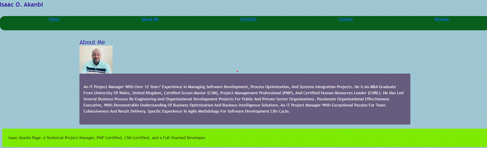
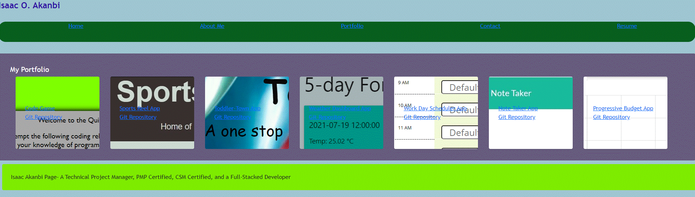
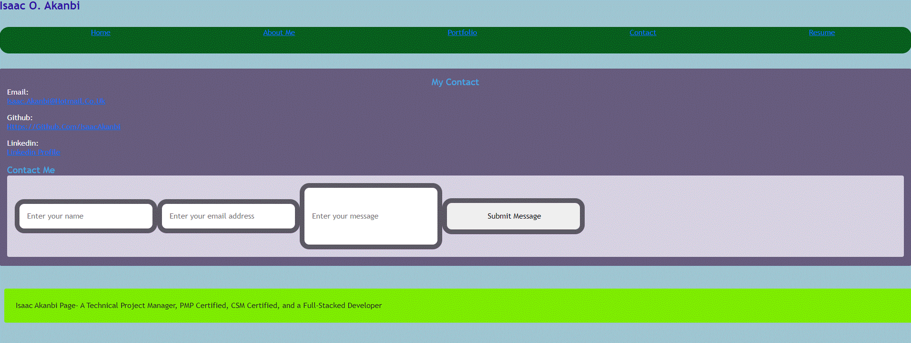
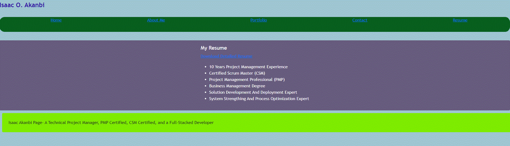

# React-Portfolio
Professional page built on React Concept

# Description
This professional page  was built with React technology, which helps to provide an excellent front-end display of various sections in customized format, making it exceptional presentable to prospective employers. There were five sections and all can be accessed through the navbar ; Home, About me, Portfolio, Contact me, and resume section. 

## About me:
This section is displayed by clicking the corresponding bar on the navigation tab. It presents a short profile page that summarizes the professional achievements, academic background, work exprience and certifications. 

## Potfolio: 
When this tab is selected, the page will display some of the applications that has been previously developed either an individual or as a member of a group. There are a total of six projects being currently displayed in this deployment, more to be added in the subsequent updates. The list includes: Code game, Sport reel app, Toddler town app, Weather dashboard, Work day schedule, note taker app, and progressive budget app. There are links to deployment pages and github repository for each of these solutions. 

## Contact: 
This page presents contact details for prospective employers to reachout, with information such as email. linkedin, and github link. Asides, the contact details, this page also provides an avenue for the visitors on this site to directly send messages, by including their name, email address, short messages, and submit button. 

## Resume: 
This page will display some key achievements (academic and professional experience), for the visitors to the site to be able to have a glance at the interesting facts about the author. In addition to that, there is also an embedded link to download a detailed pdf version of the resume. 

# Technology

[Deployed with github gh-pages]
[React-based-technology]

## Deployment page

[github] - https://github.com/IsaacAkanbi/React-Portfolio

[deployment-page] - https://isaacakanbi.github.io/React-Portfolio/

